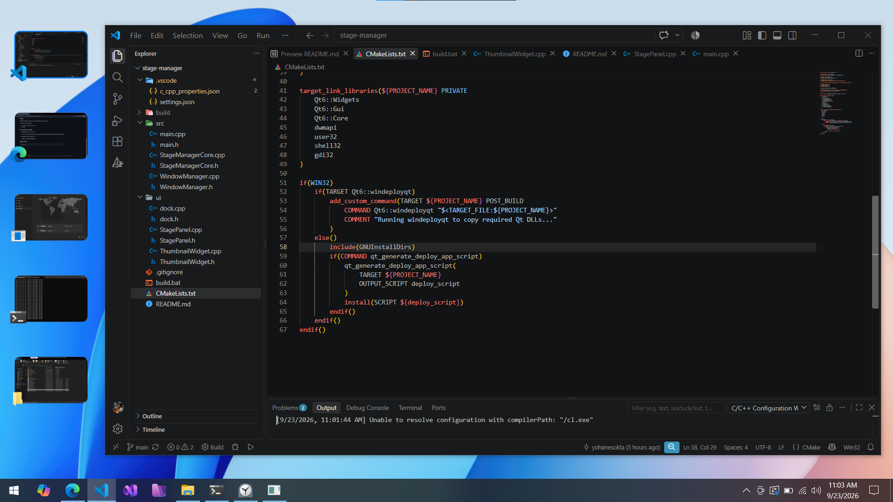

# Stage Manager Windows

On your Windows, use Stage Manager to keep the app you're working with front and centre, and your desktop clutter-free



## How To Build!

### Requerements
if you work on another outside msvc ex. msys (mingw) set manualy config.

on default config using (64bit):
- Microsoft Visual Studio 2022 or Latest
- QT MSVC

### Set Environtment Variable

- **MSVC_PATH** : located compiler msvc

  Example : `C:\Program Files\Microsoft Visual Studio\18\Community\VC\Tools\MSVC\14.51.36231\bin\Hostx64\x64`

- **QT_PATH** : located qt include path

  Example : `D:\QT\6.11.2\msvc2022_64`

### Building & Run
```bash
.\build.bat
```